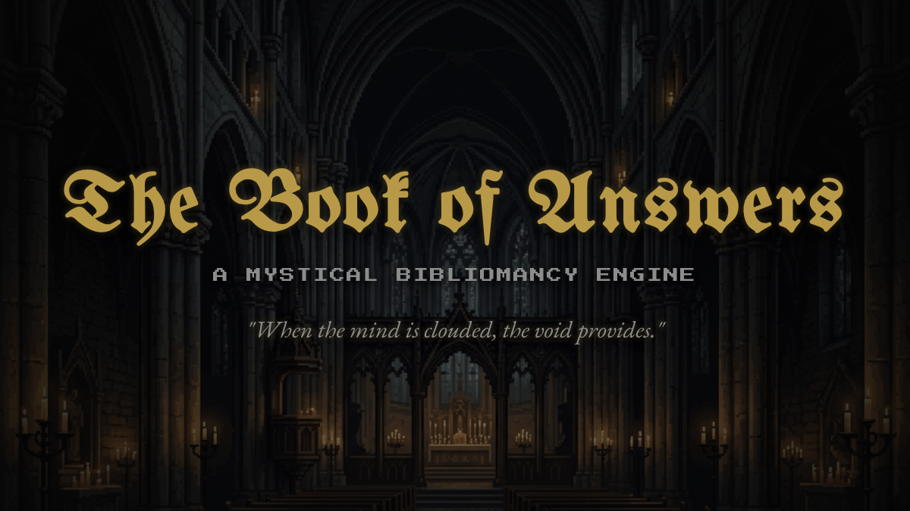

<div align="center">
  
</div>

> *When the mind is clouded and the path is obscured, the answers you seek lie within the void.*

**The Book of Answers** (codenamed ZenFlip) is a cross-platform, medieval-themed bibliomancy application built with Flutter. It simulates the experience of consulting ancient, mystical tomes to seek guidance through historical wisdom, profound quotes, and cryptic revelations.

<div align="center">
  
  
  
</div>

---

## 🔮 Features

- **The Ritual Experience**: A "Hold to Reveal" interaction mechanic that builds anticipation, rendering text character-by-character at a cinematic 4fps typewriter speed.
- **Atmospheric Environments**: Immerse yourself in interactive Sanctums (Fireplace, Ancient Library, Abandoned Church) powered by a custom-built low-framerate particle system that evokes an "Into the Spider-Verse" mixed-FPS aesthetic.
- **Six Mystical Tomes**: Consult different books tailored to your needs:
  - 🌌 **Universal Truths**: General guidance.
  - ❤️ **Matters of the Heart**: Love and connection.
  - 🔥 **The Forge of Action**: Motivation and courage.
  - 🗡️ **Brutal Honesty**: Harsh realities without sugarcoating.
  - 🌑 **Midnight Revelations**: Deep fears and the unknown.
  - 🎲 **The Void of Chaos**: Paradoxes and absurdities.
- **300 Curated Historical Quotes**: Real, profound wisdom handpicked from history's greatest philosophers, poets, and leaders (Marcus Aurelius, Sun Tzu, Rumi, Edgar Allan Poe, etc.).
- **The Keep (Journal)**: Save your most profound revelations locally. Your journal is preserved securely using `Hive` local database.

## 🎨 Design Philosophy

The application rejects modern flat design in favor of a nostalgic, tactile aesthetic:
- **Typography**: Heavily utilizes `Press Start 2P` for the UI, `EB Garamond` for profound body text, and `UnifrakturMaguntia` for gothic headers.
- **Palette**: Deep voids (`#050505`), ashen grays (`#8c8c8c`), rusted gold (`#b89947`), and abyssal hues.
- **Animation**: Background particles and flames are intentionally throttled to 8fps for a stop-motion, medieval pixel-art feel, while the UI runs smoothly at 60fps.

## 🚀 Quick Start (Local Development)

### Prerequisites
- [Flutter SDK](https://docs.flutter.dev/get-started/install) (Version 3.10+)
- Dart SDK

### Installation
1. Clone the repository:
   ```bash
   git clone https://github.com/AtelierMizumi/TheBookOfAnswers.git
   cd TheBookOfAnswers
   ```
2. Fetch dependencies:
   ```bash
   flutter pub get
   ```
3. Run the application:
   ```bash
   flutter run -d chrome # For Web
   flutter run # For Android/iOS (if devices are connected)
   ```

## 🌐 Deployment (GitHub Actions)

This repository includes a robust CI/CD pipeline using **GitHub Actions**. Upon pushing to the `main` branch, the workflow automatically:
1. Builds a highly optimized Web version and deploys it to **GitHub Pages**.
2. Compiles a production-ready **Android APK** available for download in the Actions Artifacts tab.

*If you fork this repository, ensure you enable GitHub Pages in Settings > Pages and point it to the `gh-pages` branch.*

## 📜 Architecture

- **State Management**: Built entirely on **Riverpod 3.x** using Modern `Notifier` syntax (`OracleNotifier`, `JournalNotifier`, `EnvironmentNotifier`).
- **Persistence**: **Hive** NoSQL database is used for lighting-fast, synchronous local storage of settings and journal entries.
- **Rendering**: Custom `CustomPainter` instances handle the parallax background elements to bypass standard Flutter widget overhead for particle rendering.

---

<div align="center">
  <i>"He who has a why to live for can bear almost any how." - Friedrich Nietzsche</i>
</div>
